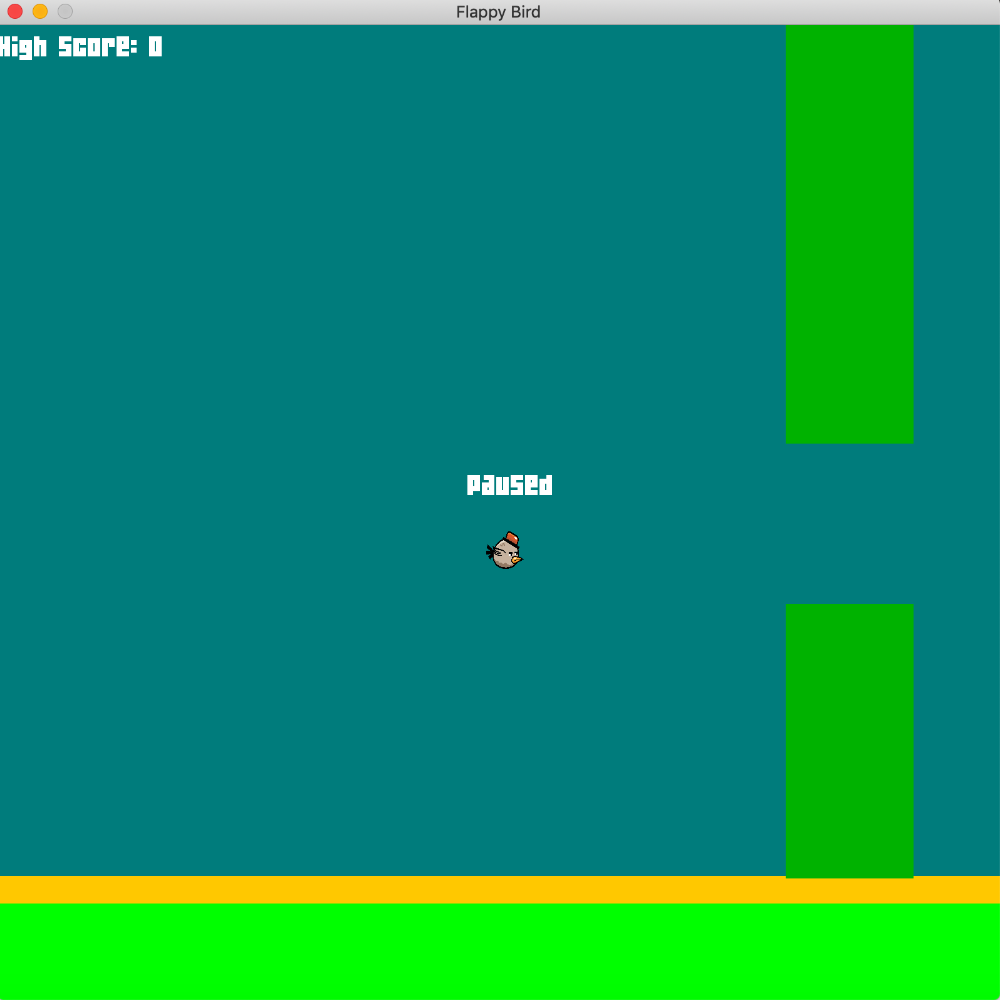

[](https://www.codefactor.io/repository/github/isthattyler/flappybird)
[](https://img.shields.io/github/languages/top/isthattyler/FlappyBird)
# Flappy Bird Game
This is my implementation on the game using Java Swing.


## Instructions
* Download the jar file in the release.

* Execute the jar file with the following command:
```bash
java -jar FlappyBird-0.0.1-jar-with-dependencies.jar 
```

ENJOY!

Lets try to edit somethin!!!
